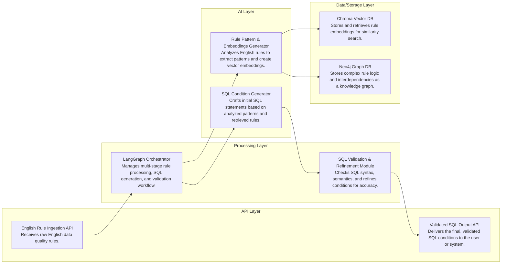

# Ai Sql

## Overview
- Transforms English data quality rules into validated SQL statements.
- Utilizes LangGraph for dynamic workflow orchestration and retry logic.
- Employs Chroma for retrieval-augmented generation and Neo4j for traceability.
- Features a multi-stage process for pattern analysis, intelligent SQL generation, and advanced validation.
- Generates high-quality, auditable SQL conditions for automated data quality enforcement.

## Business Problem
- Manual creation of SQL for data quality rules is time-consuming and prone to errors.
- Lack of a standardized, automated system to convert natural language rules into executable SQL.
- Challenges in rigorously validating generated SQL for syntax, semantics, and performance efficiency.
- Difficulty in maintaining transparent traceability between original business rules and their SQL implementations.
- Inconsistent quality and varied approaches in implementing complex data quality checks across systems.

## Key Capabilities
- **Automated Rule-to-SQL Conversion**: Transforms English data quality rules into executable SQL conditions.
- **Retrieval-Augmented Generation (RAG)**: Leverages historical successful rules for context-aware SQL generation.
- **Multi-Dimensional Validation**: Performs syntax, semantic, and test case-based validation of generated SQL.
- **LangGraph Workflow Orchestration**: Manages complex processing stages with stateful retries and conditional routing.
- **Knowledge Graph for Traceability**: Neo4j tracks relationships between rules, columns, generated SQL, and validation results.
- **Vector Database for Patterns**: Chroma stores rule embeddings and enables dynamic data pattern detection.
- **Dynamic Prompt Engineering**: Uses Jinja2 templates for context-specific and flexible LLM interactions.
- **Quality Scoring**: Assigns a comprehensive quality score (0-100) to each generated and validated SQL.

## Tech Stack
- Cloud: GCP (optional, for Gemini LLM)
- Backend: Python, LangGraph, Jinja2
- Frontend: N/A
- Data: Neo4j (Graph Database), Chroma (Vector Database), CSV
- AI/ML: LLMs (e.g., GCP Gemini, Local models), LangGraph

## Architecture Flow
1.  English data quality rules and sample data are provided as input to the system.
2.  The system performs data pattern analysis and stores rule embeddings in Chroma, with relationships in Neo4j.
3.  An intelligent SQL generator, orchestrated by LangGraph, retrieves similar successful rules from Chroma for context.
4.  Dynamic prompts are utilized to generate SQL conditions based on the input rule and retrieved context.
5.  The generated SQL undergoes a multi-dimensional validation process, including syntax, semantic, and test case checks.
6.  A quality score is assigned to the SQL; if below a threshold, the generation/validation process may be retried.
7.  Validated SQL, detailed validation results, and traceability metadata are stored in output directories and Neo4j.
8.  A comprehensive processing summary is generated, detailing the execution and quality metrics.

## Repository Structure
```
.
├── input/                  # Input rules and sample data
│   ├── rules/
│   └── data/
├── output/                 # Generated SQL, validation reports, summaries
│   ├── sql/
│   ├── validation/
│   └── summaries/
├── templates/              # Jinja2 prompt templates
├── logs/                   # System logs
├── chroma_hybrid_dq_db/    # Chroma vector database persistence
├── .env.example            # Environment variables example
├── requirements.txt        # Project dependencies
└── advanced_sql_system.py  # Main system entry point
```

## Local Setup
1.  **Clone the repository**:
    ```bash
    git clone https://github.com/ramamurthy-540835/ai_sql.git
    cd ai_sql
    ```
2.  **Install Python dependencies**:
    ```bash
    pip install -r requirements.txt
    ```
3.  **Configure environment variables**:
    *   Copy `.env.example` to `.env`.
    *   Edit `.env` to specify your LLM provider (e.g., `LLM_PROVIDER=local` or `LLM_PROVIDER=gcp` with `GEMINI_API_KEY`).
    *   Configure Neo4j connection details if running a local instance.
4.  **Run complete setup and demo (optional)**:
    ```bash
    python setup_and_demo.py
    ```
5.  **Start the main system processing**:
    ```bash
    python advanced_sql_system.py
    ```

## Deployment
1.  Ensure all necessary environment variables for LLM providers and databases are securely configured.
2.  Install project dependencies in the deployment environment using `pip install -r requirements.txt`.
3.  Verify that Neo4j and Chroma services are properly configured and accessible to the application.
4.  Execute the main processing script: `python advanced_sql_system.py`.
5.  Monitor application logs (within `logs/`) and review generated output (in `output/`) for system health and results.
## Architecture

Advanced system for converting English data quality rules into validated SQL.



For a standalone preview, see [docs/architecture.html](docs/architecture.html).

### Key Architectural Aspects:
* Utilizes a LangGraph-powered orchestrator to manage the multi-stage SQL generation and validation process.
* Employs Chroma for efficient storage and retrieval of rule embeddings based on similarity.
* Leverages Neo4j to store complex data quality rule logic and interdependencies as a knowledge graph.
* Features distinct AI-powered stages for pattern analysis, embedding generation, and initial SQL condition crafting.
